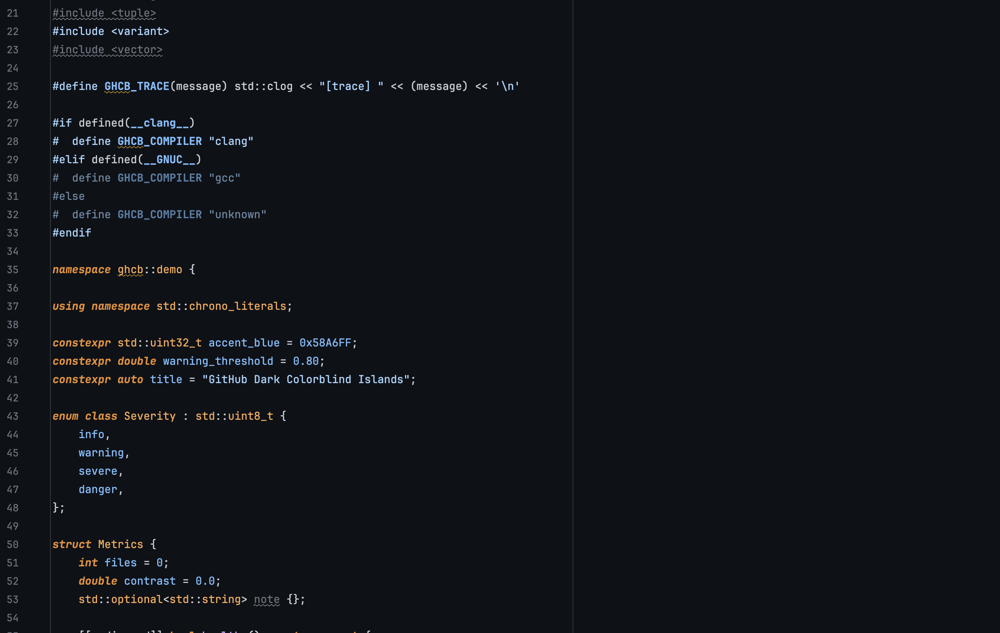
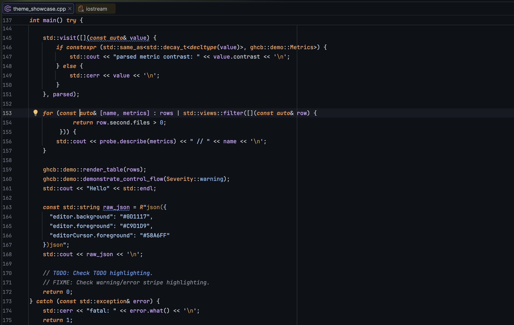

# GitHub Dark Colorblind Islands Theme

<!-- Plugin description -->
GitHub Dark Colorblind inspired theme adapted for JetBrains IDEs with the Islands parent theme.

The UI palette follows GitHub's dark colorblind / Primer tokens: `#0D1117` editor surfaces,
`#010409` recessed panels, blue success/accent states, orange danger/severe states, and
GitHub-style syntax colors for comments, strings, constants, functions, variables, and entities.

This theme specifically supports the new "Islands" UI elements and includes both italic and no-italic variants.
<!-- Plugin description end -->

## Install

Build the plugin ZIP and install it from disk in CLion:

```sh
./gradlew clean buildPlugin
```

Then open **Settings | Plugins | Install Plugin from Disk...** and select:

```text
build/distributions/GitHub Dark Colorblind Islands-0.1.2.zip
```

## Variants

- `GitHub Dark Colorblind Islands`: italic comments and bold-italic keywords.
- `GitHub Dark Colorblind Islands No Italic`: upright comments and bold-only keywords.

## Showcase





## Development

The plugin identity is configured as `dev.aiwen.github-dark-colorblind-islands-theme`.

Open `examples/theme_showcase.cpp` in CLion to inspect the editor colors across C++ comments,
keywords, strings, constants, functions, classes, templates, diagnostics, and control flow.

## Attribution

Forked from the MIT-licensed Gruvbox Islands theme project. The icon is intentionally abstract
and only uses this theme palette; it does not copy GitHub product marks.
